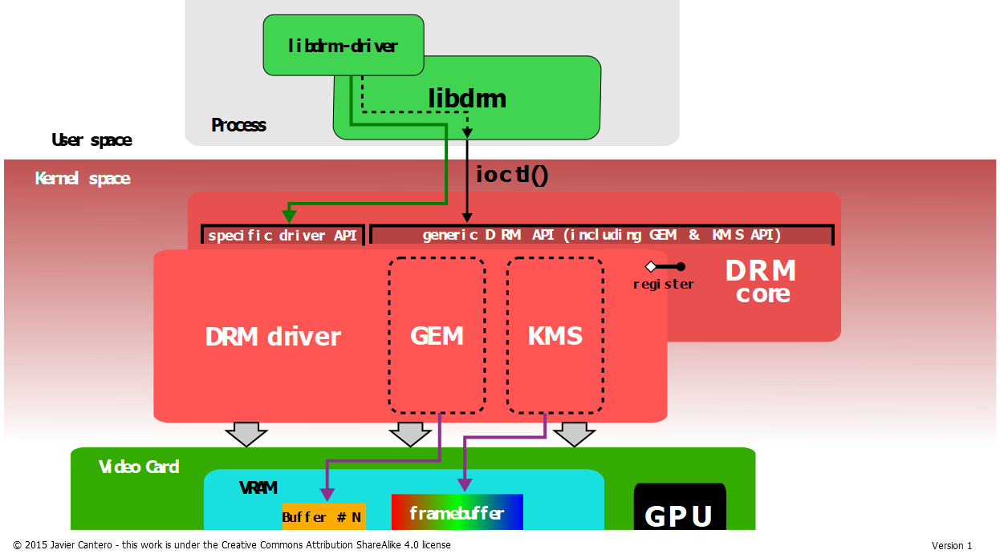

## 第四章 第一节 DRM 驱动框架简介

### DRM是什么？

DRM —— buffer management、Frame Buffer / plane、Kernel Mode Setting

DRM是一个由 Linux Kernel 内核引出的功能性接口，功能实质类似于HW Composer + gralloc

我们可以从用户空间、内核空间的两个角度去了解DRM框架：

用户空间（libdrm driver）：

- Libdrm（DRM框架在用户空间的Lib）

内核空间（DRM driver）：

- KMS（Kernel Mode Setting，内核显示模式设置）
- GEM（Graphic Execution Manager，图形执行管理器）

DRM框架共由以下部分组成

### Libdrm

DRM框架在用户空间提供的Lib，用户或应用程序在用户空间调用libdrm提供的库函数， 即可访问到显示的资源，并对显示资源进行管理和使用。

这样通过libdrm对显示资源进行统一访问，libdrm将命令传递到内核最终由DRM驱动接管各应用的请求并处理， 可以有效避免访问冲突。

### KMS（Kernel Mode Setting）

KMS属于DRM框架下的一个大模块，主要负责两个功能：显示参数及显示控制。 这两个基本功能可以说是显示驱动必须基本的能力，在DRM框架下， 为了将这两部分适配得符合现代显示设备逻辑，又分出了几部分子模块配合框架。

#### Planes

基本的显示控制单位，每个图像拥有一个Planes，Planes的属性控制着图像的显示区域、图像翻转、色彩混合方式等， 最终图像经过Planes并通过CRTC组件，得到多个图像的混合显示或单独显示的等等功能。

#### CRTC

CRTC的工作，就是负责把要显示图像，转化为底层硬件层面上的具体时序要求，还负责着帧切换、电源控制、色彩调整等等。

#### Encoder

Encoder的工作则是负责电源管理、视频输出格式封装（比如要将视频输出到HDMI接口、MIPI接口等）。

#### Connector

Connector连接器负责硬件设备的接入、屏参获取等。

上述的这些组件，最终完成了一个完整的DRM显示控制过程，如下图所示：

### GEM（generic DRM memory-management）

顾名思义，GEM负责对DRM使用的内存（如显存）进行管理。

GEM框架提供的功能包括：

- 内存分配和释放
- 命令执行
- 执行命令时的管理

本文中相关引用：

1.https://dri.freedesktop.org/docs/drm/gpu/drm-mm.html#the-graphics-execution-manager-gem

2.https://dri.freedesktop.org/docs/drm/gpu/drm-kms.html#kernel-mode-setting-kms
